# Gallery of Marlowe Contracts on Cardano Mainnet

Click on the image below to navigate to individual contracts.

[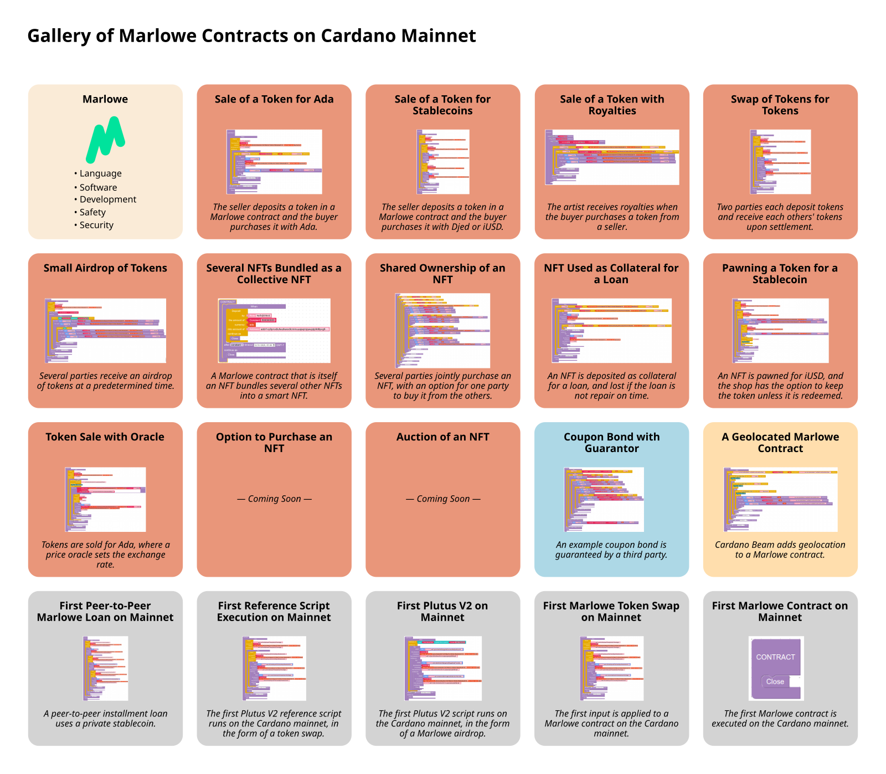](http://testing.marlowe.run/real-world-marlowe.svg)

## Marlowe

- [Language](https://marlowe.iohk.io/)
- [Software](https://github.com/input-output-hk/marlowe-cardano/)
- [Development](https://developers.cardano.org/docs/smart-contracts/marlowe/#resources-for-developing-and-deploying-marlowe-contracts)
- [Safety](https://github.com/input-output-hk/marlowe-cardano/blob/main/marlowe/best-practices.md)
- [Security](https://github.com/input-output-hk/marlowe-cardano/blob/main/marlowe/security.md)

## Contracts

| Summary | Contract | Description |
|---------|----------|-------------|
| [Sale of a Token for Ada](nfts/simple/ReadMe.ipynb) |  | The seller deposits a token in a Marlowe contract and the buyer purchases it with Ada. |
| [Sale of a Token for Stablecoins](nfts/stable/ReadMe.ipynb) | 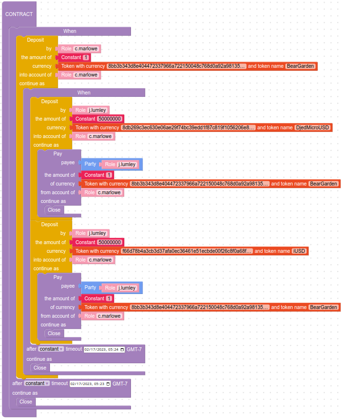 | The seller deposits a token in a Marlowe contract and the buyer purchases it with Djed or iUSD. |
| [Sale of a Token with Royalties](nfts/royalty/ReadMe.ipynb) | 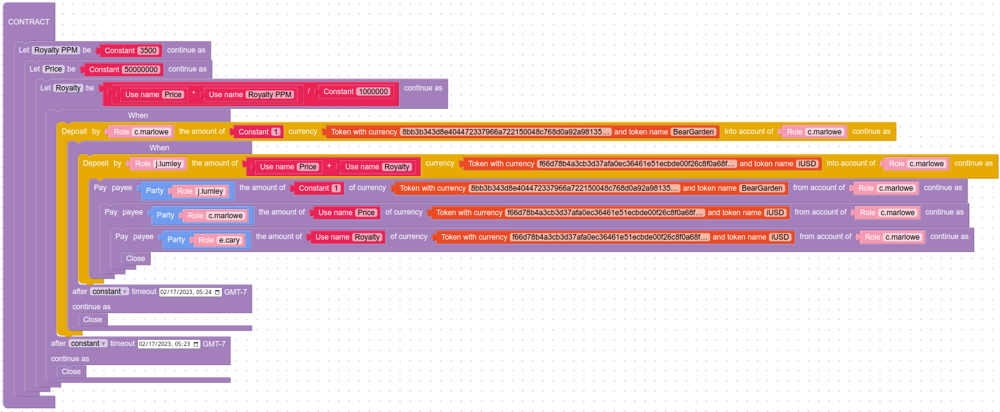 | The artist receives royalties when the buyer purchases a token from a seller. |
| [Swap of Tokens for Tokens](nfts/swap/ReadMe.ipynb) |  | Two parties each deposit tokens and receive each others' tokens upon settlement. |
| [Small Airdrop of Tokens](nfts/airdrop/ReadMe.ipynb) | 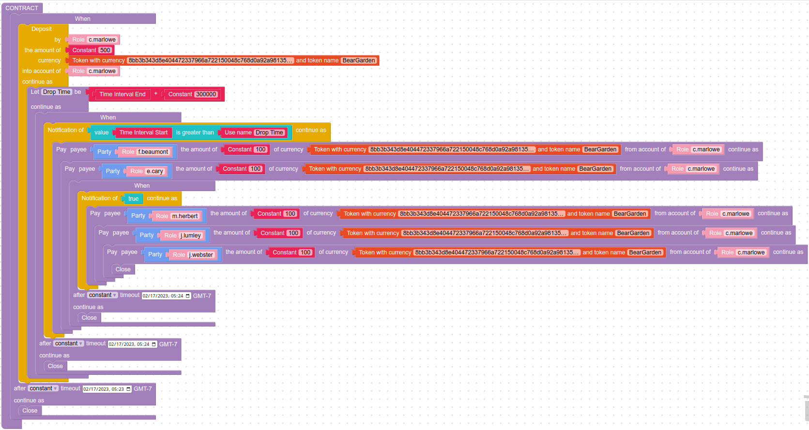 | Several parties receive an airdrop of tokens at a predetermined time. |
| [Several NFTs Bundled as a Collective NFT](nfts/collection/ReadMe.ipynb) |  | A Marlowe contract that is itself an NFT bundles several other NFTs into a smart NFT. |
| [Shared Ownership of an NFT](nfts/shared/ReadMe.ipynb) | 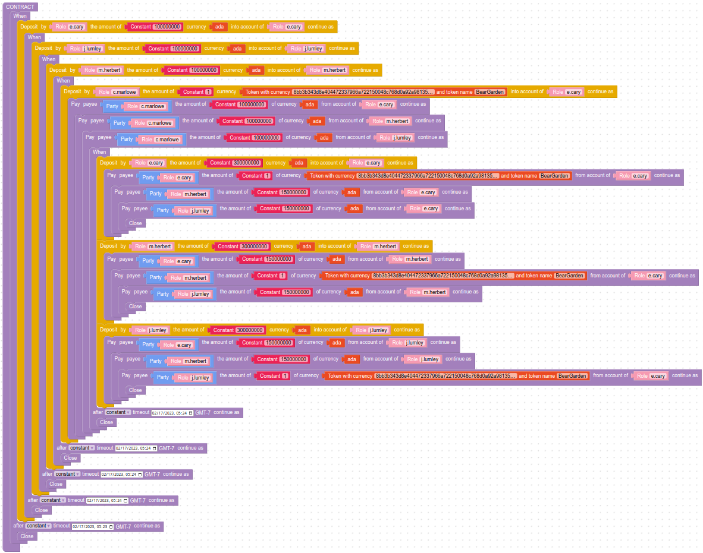 | Several parties jointly purchase an NFT, with an option for one party to buy it from the others. |
| [NFT Used as Collateral for a Loan](nfts/collateral/ReadMe.ipynb) | 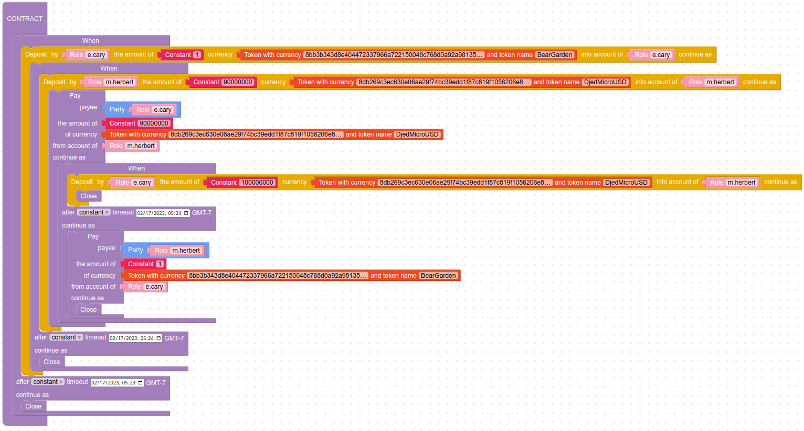 | An NFT is deposited as collateral for a loan, and lost if the loan is not repaid on time. |
| [Pawning a Token for a Stablecoin](nfts/pawn/ReadMe.ipynb) | 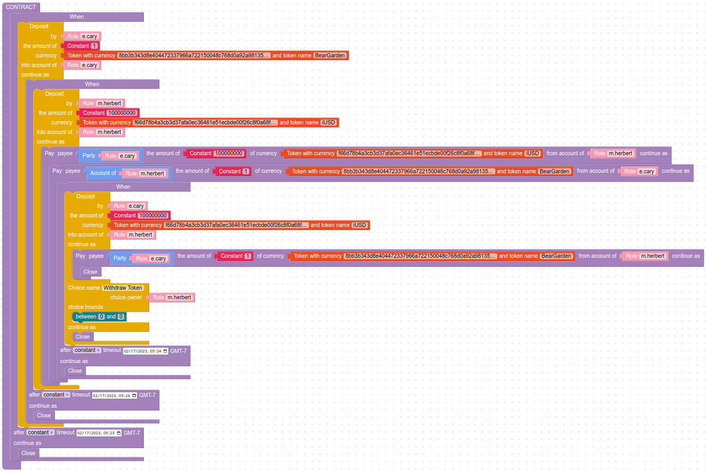 | An NFT is pawned for iUSD, and the shop has the option to keep the token unless it is redeemed. |
| [Token Sale with Oracle](nfts/oracle/ReadMe.ipynb) | 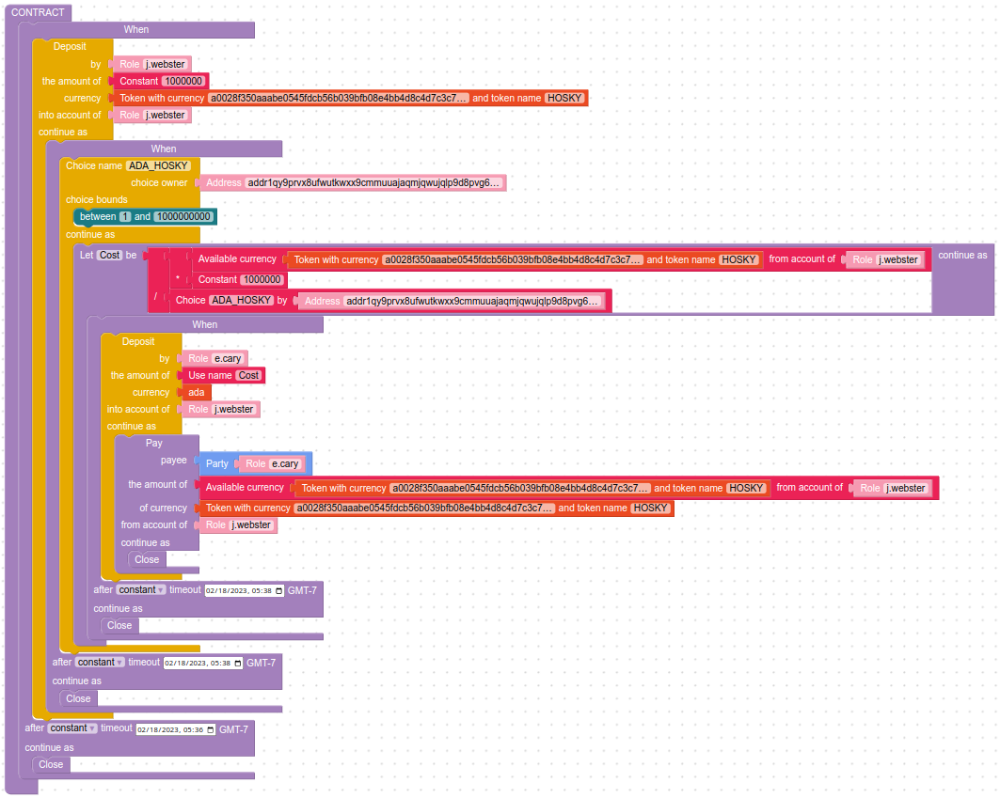 | Tokens are sold for Ada, where a price oracle sets the exchange rate. |
| [Auction of an NFT](nfts/auction/ReadMe.ipynb) | 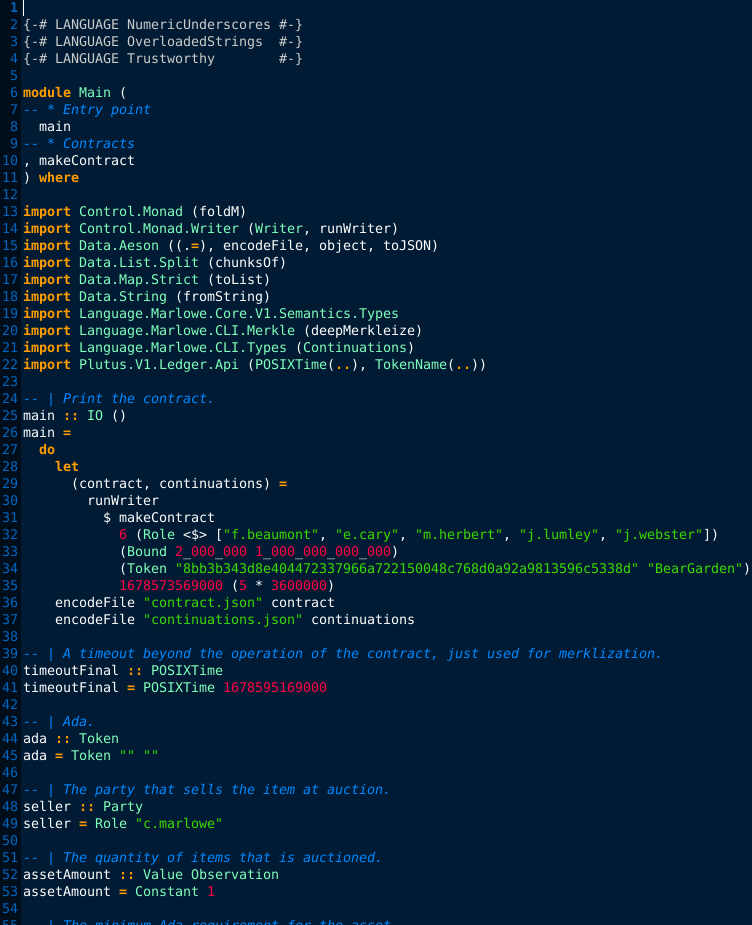 | An English auction is held to sell an NFT to the highest bidder. |
| [ACTUS Contract for Principal at Maturity](realfi/actus/actus-pam.ipynb) | 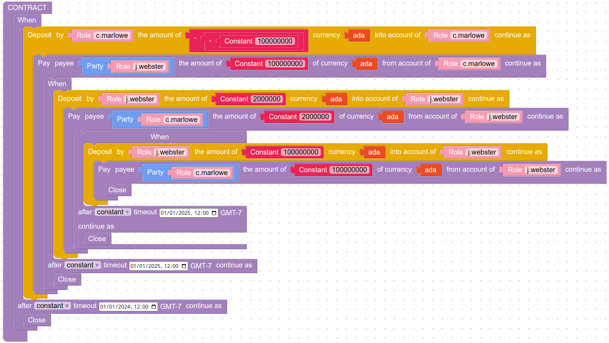 | Interest is paid periodically for a loan, with the final payment being the principal. |
| [Coupon Bond with Guarantor](realfi/coupon-bond-guaranteed/ReadMe.ipynb) |  | An example coupon bond is guaranteed by a third party. |
| [A Geolocated Marlowe Contract](defi/beamer/ReadMe.ipynb) |  | Cardano Beam adds geolocation to a Marlowe contract |
| [First Peer-to-Peer Marlowe Loan on Mainnet](firsts/loan/ReadMe.ipynb) | 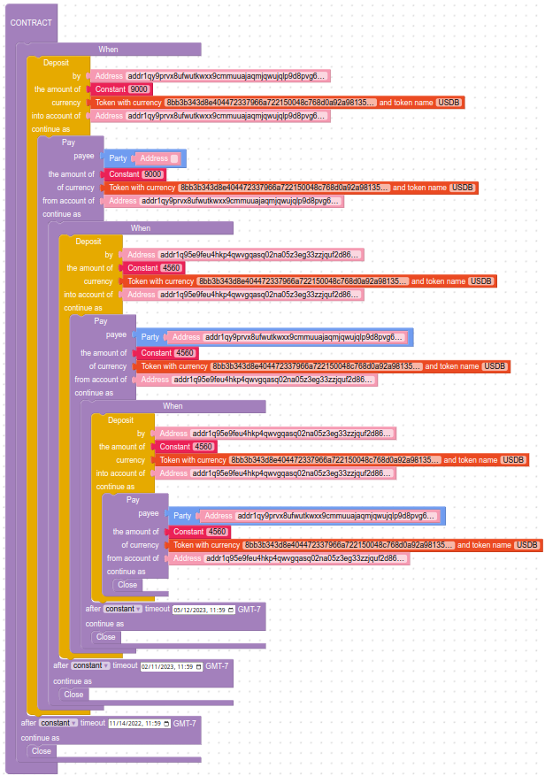 | A peer-to-peer installment loan uses a private stablecoin. |
| [First Reference Script Execution on Mainnet](firsts/reference/ReadMe.ipynb) | 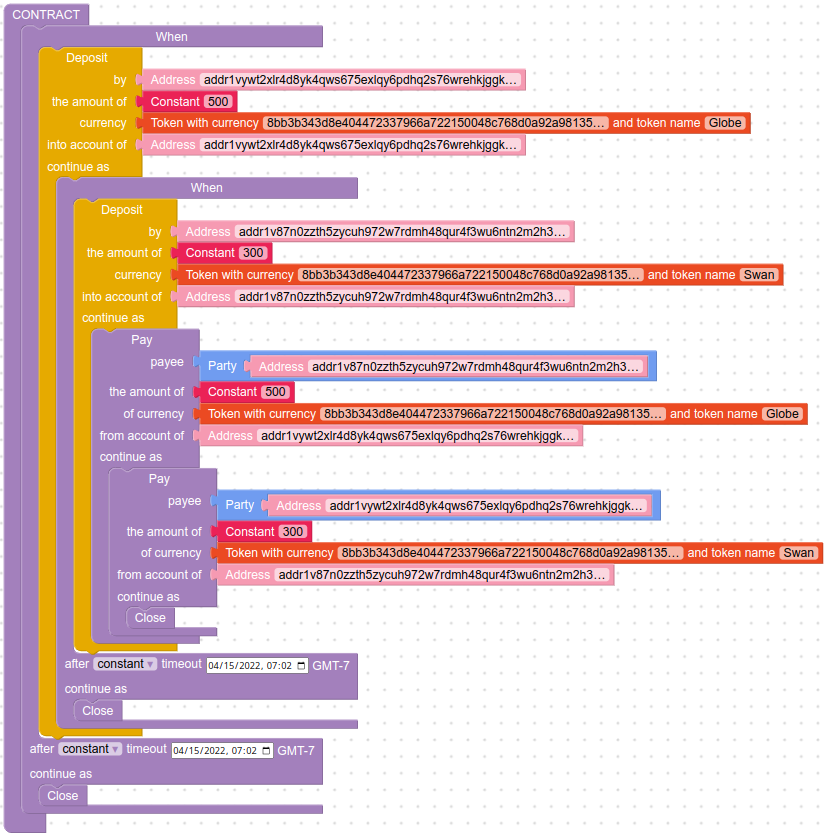 | The first Plutus V2 reference script runs on the Cardano mainnet, in the form of a Marlowe token swap. |
| [First Plutus V2 on Mainnet](firsts/plutus-v2/ReadMe.ipynb) | 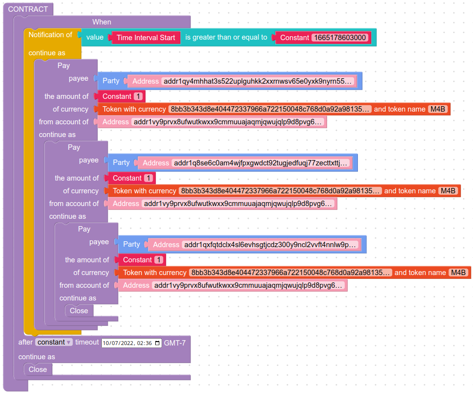 | The first Plutus V2 script runs on the Cardano mainnet, in the form of a Marlowe airdrop. |
| [First Marlowe Token Swap on Mainnet](firsts/swap/ReadMe.ipynb) |  | The first input is applied to a Marlowe contract on the Cardano mainnet. |
| [First Marlowe Contract on Mainnet](firsts/mainnet/ReadMe.ipynb) | 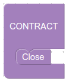 | The first Marlowe contract is executed on the Cardano mainnet. |
