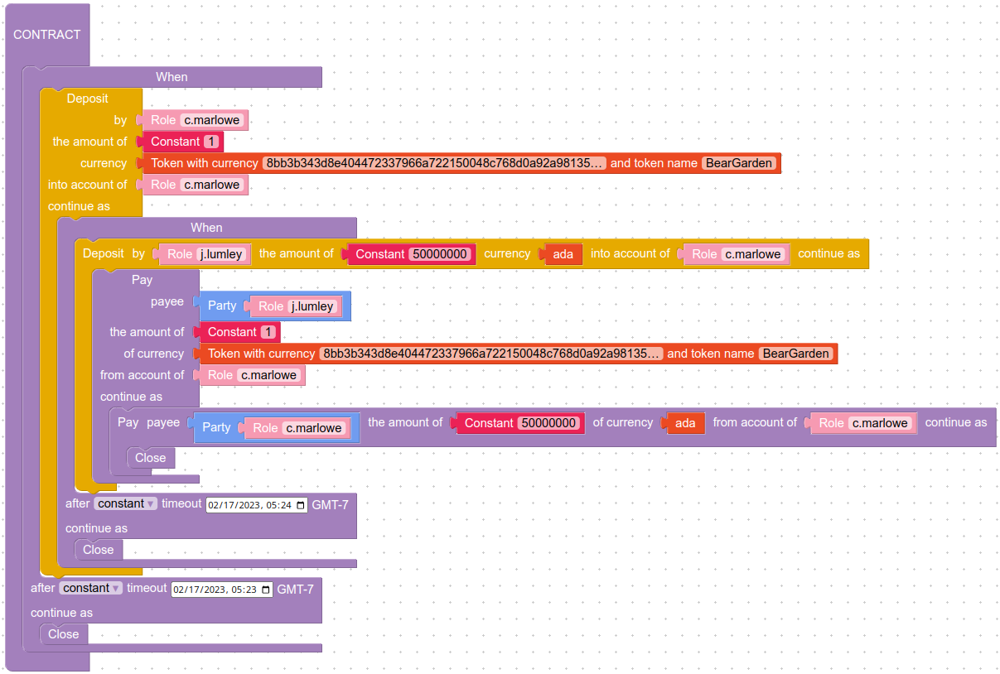
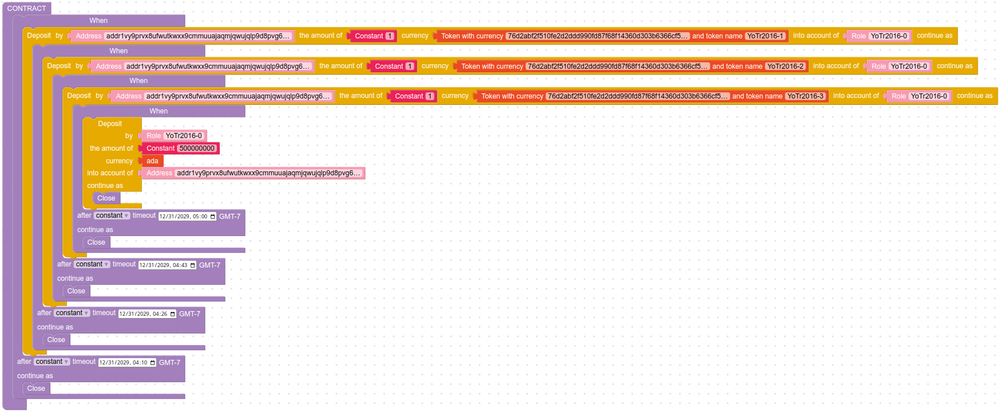

**DISCLAIMER:** This is an unofficial personal repository not affiliated with any Cardano organization or [IOHK](https://iohk.io/). The [Marlowe Cardano software](https://github.com/input-output-hk/marlowe-cardano/) is licensed under [the Apache-2.0 license](https://github.com/input-output-hk/marlowe-cardano/blob/main/LICENSE).

# A Gallery of Marlowe Contracts on Cardano Mainnet

## Marlowe

- [Language](https://marlowe-finance.io/)
- [Software](https://github.com/input-output-hk/marlowe-cardano/)
- [Development](https://developers.cardano.org/docs/smart-contracts/marlowe/#resources-for-developing-and-deploying-marlowe-contracts)
- [Safety](https://github.com/input-output-hk/marlowe-cardano/blob/main/marlowe/best-practices.md)
- [Security](https://github.com/input-output-hk/marlowe-cardano/blob/main/marlowe/security.md)

## Contracts

| Summary | Contract | Description |
|---------|----------|-------------|
| [Sale of a Token for Ada](nfts/simple-sale/ReadMe.ipynb) |  | The seller deposits a token in a Marlowe contract and the buyer purchases it with Ada. |
| [Several NFTs Bundled as a Collective Marlowe NFT](nfts/collective/ReadMe.ipynb) |  | A Marlowe contract that is itself an NFT collects several other NFTs into a smart NFT. |
| [Coupon Bond with Guarantor](realfi/coupon-bond-guaranteed/ReadMe.ipynb) |  | An example coupon bond is guaranteed by a third party. |
| [A Geolocated Marlowe Contract](defi/beamer/ReadMe.ipynb) |  | Cardano Beam adds geolocation to a Marlowe contract |
| [First Peer-to-Peer Marlowe Loan on Mainnet](firsts/loan/ReadMe.ipynb) |  | A peer-to-peer installment loan uses a private stablecoin. |
| [First Reference Script Execution on Mainnet](firsts/reference/ReadMe.ipynb) |  | The first Plutus V2 reference script runs on the Cardano mainnet, in the form of a Marlowe token swap. |
| [First Plutus V2 on Mainnet](firsts/plutus-v2/ReadMe.ipynb) |  | The first Plutus V2 script runs on the Cardano mainnet, in the form of a Marlowe airdrop. |
| [First Marlowe Token Swap on Mainnet](firsts/swap/ReadMe.ipynb) |  | The first input is applied to a Marlowe contract on the Cardano mainnet. |
| [First Marlowe Contract on Mainnet](firsts/mainnet/ReadMe.ipynb) |  | The first Marlowe contract is executed on the Cardano mainnet. |
